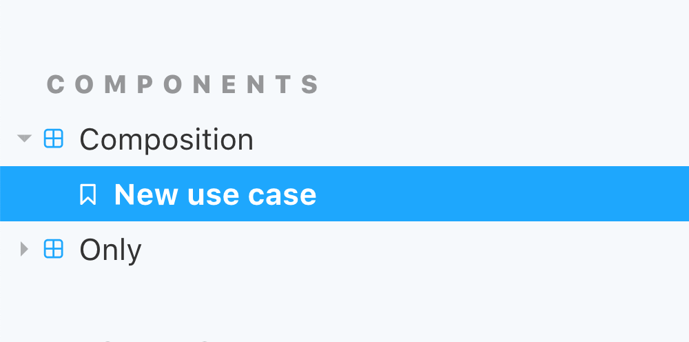
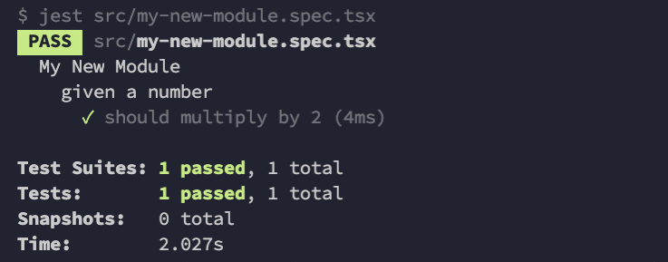
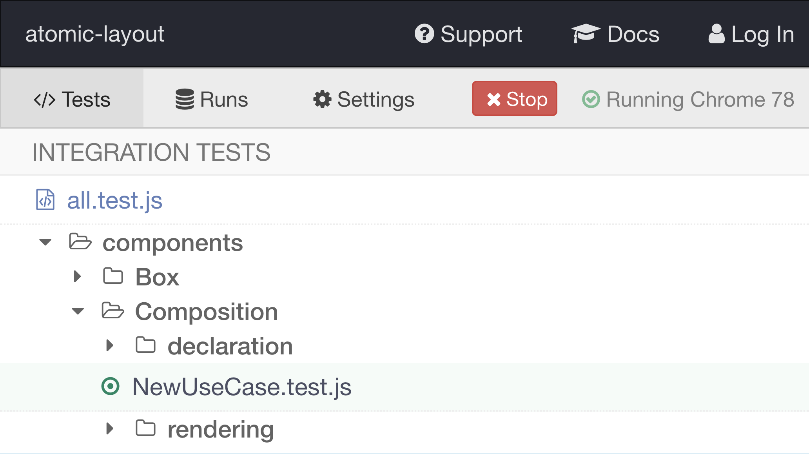

# Contributing guidelines

Thank you for deciding to contribute to Atomic Layout! This document will aim to make your contribution a smooth process, so please read it thoroughly. You're awesome.

## Pre-requisites

### 1. Fork the repository

```bash
$ git clone git@github.com:kettanaito/atomic-layout.git
```

### 2. Install Yarn

Atomic Layout uses [Yarn][yarn] for package management. See the [Yarn installation guidelines][yarn-installation] for instructions on how to install Yarn on your machine.

Verify that Yarn is installed by running:

```bash
$ yarn --version
1.19.0
```

### 3. Install dependencies

```bash
# Go to the library's directory
$ cd atomic-layout
# And install its dependencies
$ yarn install
```

---

## Git workflow

### 1. Create a branch

```bash
$ git checkout -b ISSUE_NUMBER-BRANCH_NAME
```

> For example: `git checkout -b 123-responsive-fix`

### 2. Develop

Create, fix or experiment. Follow the [Development guidelines](#development) for the development process overview.

### 3. Commit

```bash
$ git add path/to/changes.js
$ git commit -m 'Improves initial render'
```

### 4. Push

```bash
$ git push -u origin <BRANCH_NAME>
```

### 5. Open a pull request

- [**Create a pull request**][repo-pull-request]

Click on the link below to create a new Pull request. Please choose `base: master` on the left and `compare: <YOUR_BRANCH_NAME>` on the right. Click on "Create pull request" button to confirm.

Once created, fill in the Pull request template with the requested information.

### 6. Code review

Once your pull request is opened one of the core contributors of the library will give you a code review. Please be patient and polite, we're on the same side here!

### 7. Welcome to contributors!

When approved, your changes will be merged into `master` by one of the library's core maintainers. With your avatar proudly shining in the [Contributors list][repo-contributors], welcome to the contributors!

---

## Development

- [**TypeScript**][typescript] (_JavaScript superset with strong types_)

### Monorepo structure

- [Lerna](https://github.com/lerna/lerna) (_monorepo manager_)

Atomic Layout is a _mono-repository_. This means that it contains multiple repositories listed in the `packages/` directory. Examples of such repositories are:

- `packages/atomic-layout-core`
- `packages/atomic-layout`

When developing a feature or fixing an issue, navigate to the respective repository in the `packages/` directory. For example, to fix an issue in `atomic-layout` library perform the following commands:

```bash
$ cd packages/atomic-layout
```

Each package has the set of similar commands for development and testing, but always check the list of commands in the respective `package.json` file. Instructions below will explain a general development workflow using `packages/atomic-layout` as an example.

### Running a local build

To build the package in development mode run:

```bash
$ yarn start
```

### Running Storybook

- [Storybook][storybook] (_UI component explorer_)

Atomic Layout development is done in [Storybook](#). Each story is a usage scenario and _end-to-end test suite_ at the same time. Please check the existing stories before creating a new one, there is a high change such usage scenario already exists.

```bash
$ yarn storybook
```

#### Creating a story

To create a new story choose a proper folder in the `examples/` directory and create a new `MyNewStory.jsx` file. Please refer to the existing stories for reference and inspiration.

Here's an example of how a new story may look like:

```tsx
// examples/components/Composition/NewUseCase.jsx
import React from 'react'
import { Composition } from 'atomic-layout'

const NewUseCase = () => (
  <Composition templateCols="250px 1fr">
    <span id="first">First</span>
    <span id="second">Second</span>
  </Composition>
)

export default NewUseCase
```

> Replace `NewUseCase` with the cammelCase title of the use case you are describing.

After the story is created add it to the list of all stories in `examples/index.js`:

```js
// examples/index.js
const NewUseCase = require('./components/Composition/NewUseCase')

storiesOf('Components|Composition', module).add('New use case', NewUseCase)
```

> If you are adding a new story you must also [add a new E2E test](#writing-e2e-tests) that tests that story. A story without a corresponding E2E test is considered unnecessary.

Verify your story by [Running Storybook](#running-storybook) and finding your new story in the respective section in Storybook.



## Testing

There are two kinds of tests in Atomic Layout: _unit_ and _end-to-end_ (E2E) tests. Depending on the type of your changes you would need to run one or both test types to verify your changes.

### Unit tests

#### Running unit tests

- [Jest][jest] (_JavaScript testing framework_)

To run all unit tests of the library execute the following command:

```bash
$ yarn test:unit
```

#### Writing unit tests

Create a `[filename].spec.ts` file alongside the module you would like to test. Refer to the existing test suites (`*.spec.ts`) for and inspiration.

Here's an example of a small unit test:

```ts
import myNewModule from './my-new-module'

describe('My New Module', () => {
  describe('given a number', () => {
    it('should multiply by 2', () => {
      expect(myNewModule(5)).toEqual(10)
    })
  })
})
```

Verify your newly added unit test by running:

```bash
$ yarn jest path/to/my-new-module.spec.ts
```



##### Useful unit testing materials:

- [**Jest assertions**][jest-assertions]

### E2E tests

- [Cypress][cypress] (_JavaScript end-to-end testing framework_)

End-to-end tests are being run against a running Storybook instance. **This means you should [run Storybook](#running-storybook) first, before trying to run end-to-end tests**.

#### Running E2E tests

To run E2E tests locally, perform:

```bash
$ yarn cypress
```

> This launches a [Cypress][cypress] app with a list of test suites. Choose a specific test suite to run, or run all tests.

#### Writing E2E tests

E2E tests assert certain usage scenarios. First, add a usage scenario by [Creating a new story](#creating-a-story) in Storybook.

Once you've created the usage scenario, add a new `[scenario].test.js` module next to your newly created scenario. This will be your end-to-end test suite.

Here's an example of what an E2E test suite may look like:

```tsx
describe('New usage scenario', () => {
  before(() => {
    cy.loadStory(['components', 'composition'], ['new-use-case'])
  })

  it('should render two columns', () => {
    cy.get('#first').should('be.visible')
    cy.get('#second').should('be.visible')
  })
})
```

Please refer to the existing end-to-end tests for inspiration.

Verify your newly created E2E test by [Running E2E tests](#running-e2e-tests) and choosing your E2E test suite in the list of available tests.



##### Useful E2E testing materials:

- [**Cypress assertions**][cypress-assertions]
- [Custom Cypress commands][repo-cy-commands]

### Verifying changes

There is a shorthand command to verify your newly introduced changes on local:

```bash
$ yarn verify
```

> This is going to build and test all the packages. This command can also be run in a package's directory to verify that respective package.

## Afterword

In case of any questions please ping one of the library's maintainers on [Discord](https://discordapp.com/channels/102860784329052160/543033450924474378). And don't worry, we are more than happy to assist you during the code review phase. Looking forward to your contributions!

[repo-contributors]: https://github.com/kettanaito/atomic-layout/graphs/contributors
[repo-pull-request]: https://github.com/kettanaito/atomic-layout/compare
[repo-cy-commands]: https://github.com/kettanaito/atomic-layout/blob/master/cypress/support/commands.js
[yarn]: https://yarnpkg.com/
[yarn-installation]: https://yarnpkg.com/lang/en/docs/install/#mac-stable
[typescript]: https://www.typescriptlang.org/
[jest]: jest
[jest-assertions]: https://jestjs.io/docs/en/expect
[cypress]: https://www.cypress.io/
[cypress-assertions]: https://docs.cypress.io/guides/references/assertions.html#Common-Assertions
[storybook]: storybook
