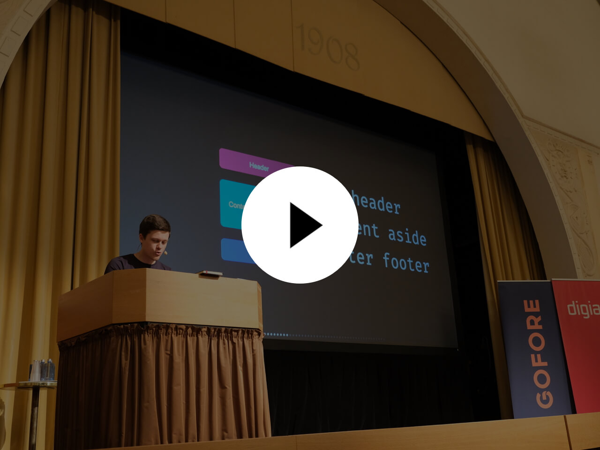
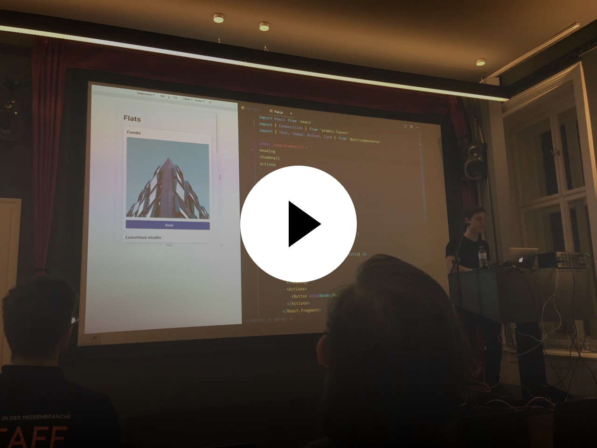

<p align="center">
  <a href="https://www.npmjs.com/package/atomic-layout" target="_blank">
    
  </a>
  <a href="https://github.com/kettanaito/atomic-layout/releases">
    
  </a>
  <a href="https://circleci.com/gh/kettanaito/atomic-layout" target="_blank">
    
  </a>
  <a href="https://coveralls.io/github/kettanaito/atomic-layout" target="_blank">
    
  </a>
  
  <a href="https://david-dm.org/kettanaito/atomic-layout" target="_blank">
    
  </a>
  <a href="https://david-dm.org/kettanaito/atomic-layout?type=dev" target="_blank">
    
  </a>
  <a href="https://img.shields.io/discord/102860784329052160.svg?label=Chat&logo=discord&style=flat">
    
  </a>
</p>

<br>

<p align="center">
  
</p>

<h1 align="center"><span>Atomic layout</span></h1>

**Atomic layout** is a spatial distribution library for React. It uses [CSS Grid](https://developer.mozilla.org/en-US/docs/Web/CSS/CSS_Grid_Layout) to define layout areas and render them as React components. This pattern encourages separation of elements and spacing, preventing contextual implementations and boosting maintenance of layouts.

```jsx
import React from 'react'
import { Composition } from 'atomic-layout'

// Define layout areas–visual representation
// of what composes a layout, without caring
// what components are rendered inside.
const areasMobile = `
  thumbnail
  header
  footer
`

// Responsive areas? Built-in!
const areasTablet = `
  thumbnail header
  thumbnail footer
`

const Card = ({ title, imageUrl, actions }) => (
  <Composition areas={areasMobile} areasMd={areasTablet} gap={20}>
    {/* Get React components based on provided areas */}
    {({ Thumbnail, Header, Footer }) => (
      <React.Fragment>
        <Thumbnail>
          {/* Render anything, including another Composition */}
          
        </Thumbnail>
        {/* Preserve semantics with polymorphic prop */}
        <Header as="h3">{title}</Header>
        {/* Responsive props: just suffix with a breakpoint name */}
        <Footer padding={10} paddingMd={20}>
          {actions}
        </Footer>
      </React.Fragment>
    )}
  </Composition>
)

export default Card
```

> Atomic layout is responsive by default. It uses [Bootstrap 4 breakpoints](https://getbootstrap.com/docs/4.0/layout/grid/#grid-options), but you can [define custom breakpoints](https://redd.gitbook.io/atomic-layout/api/layout/configure#breakpoints) to match your requirements.

## Motivation

Think of how we create layouts today. Most likely we define a set of reusable units \(atoms\) to combine them into functional compositions. But how do we handle spacing that should describe the position of our units? Usually, we manage CSS properties of those units to make sure the spacing is just right. Not only that results into writing redundant CSS, but it also makes our atoms **contextual** and, thus, **non-maintainable**.

Atomic layout solves this problem by exposing a dedicated layer responsible for spacial distribution in a layout, or any of its parts. That allows to reuse atom components in any layout possible **without mutating** them.

## Install

```bash
npm install atomic-layout
```

> Make sure to have [React](https://github.com/facebook/react) (16.0+) and [styled-components](https://github.com/styled-components/styled-components) (4.0+) installed.

## Documentation

> See the [Official documentation](https://redd.gitbook.io/atomic-layout).

Here are some shortcuts to get you started:

- [Motivation](https://redd.gitbook.io/atomic-layout/general/motivation)
- [**Getting started**](https://redd.gitbook.io/atomic-layout/general/getting-started)
- [Responsive props](https://redd.gitbook.io/atomic-layout/fundamentals/responsive-props)
- [Recipes](https://redd.gitbook.io/atomic-layout/recipes/semantics)

## Materials

<table border="0">
  <tr>
    <td>
      <a href="https://www.youtube.com/watch?v=_HrXUB97xQs">
        
      </a>
    </td>
    <td>
      <h3><a href="https://www.youtube.com/watch?v=_HrXUB97xQs">Creating layouts that last (React Finland, 2019)</a></h3>
      <p>Find out the main aspects of a layout's maintainability and why spacing plays a crucial role in it. Learn how to wield layout composition as an actual React component–a missing glue for your elements and design systems.</p>
      <ul>
        <li><a href="https://codesandbox.io/s/5wwp76310n"><strong>Live demo</strong></a></li>
      </ul>
    </td>
  </tr>
  <tr>
    <td>
      
    </td>
    <td>
      <h3><a href="https://survivejs.com/blog/atomic-layout-interview/">Layout composition as a React component (SurviveJS)</a></h3>
      <p>Read through the extensive interview about how Atomic layout came to be, how it's different from other solutions, and which practices it encourages.</p>
    </td>
  </tr>
  <tr>
    <td>
      <a href="https://www.youtube.com/watch?v=x_93DjN_bUA">
        
      </a>
    </td>
    <td>
      <h3><a href="https://www.youtube.com/watch?v=x_93DjN_bUA">The Future of Layouts (React Vienna, 2018)</a></h3>
      <p>Watch Artem discussing the biggest obstacle to achieve maintainable layouts, and showcases a way to combine existing technologies to build clean UI implementations using Atomic layout.</p>
      <ul>
        <li><a href="https://codesandbox.io/s/8z6xnmnnnj"><strong>Live demo</strong></a></li>
        <li><a href="http://future-of-layouts.surge.sh">Slides</a></li>
      </ul>
    </td>
  </tr>
</table>

## Browser support

> **See the [Support table for CSS Grid](https://caniuse.com/css-grid)**. For Internet Explorer support please see [this issue](https://github.com/kettanaito/atomic-layout/issues/92).

## Contributing

Thank you for deciding to contribute! Your involvement makes a significant impact on the library and its future.

Please read the [Contribution guidelines](https://redd.gitbook.io/atomic-layout/developers/contributing), and browse through the issues labeled [`help wanted`](https://github.com/kettanaito/atomic-layout/labels/help%20wanted) or [`good first issue`](https://github.com/kettanaito/atomic-layout/labels/good%20first%20issue). Those are a good place to start. Feature suggestions or bug reports, discussion, and pull requests are always welcome!
