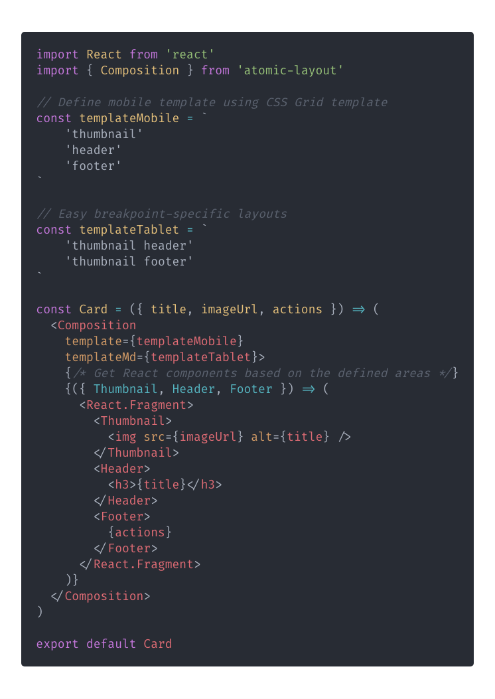

<p align="center">
  <a href="https://www.npmjs.com/package/atomic-layout" target="_blank">
    
  </a>
  <a href="https://circleci.com/gh/kettanaito/atomic-layout" target="_blank">
    
  </a>
  <a href="https://coveralls.io/github/kettanaito/atomic-layout" target="_blank">
    
  </a>
  
  
  
</p>

<br>

<p align="center">
  
</p>

<h1 align="center">Atomic layout</h1>

[Atomic layout](https://github.com/kettanaito/atomic-layout) is an implementational paradigm that delegates spacial distribution between any layout composites to the dedicated layer. It helps to create declarative, immutable, and maintainable layouts based on CSS Grid.

<br>

<p align="center">
  
</p>

> Atomic layout uses [Bootstrap 4 breakpoints](https://getbootstrap.com/docs/4.0/layout/grid/#grid-options) by default. You can always [define custom breakpoints](https://atomic-layout.js.org/api/layout/configure) to match your very requirements.

## Motivation

Think of how we create layouts today. Most likely we define a set of reusable units \(atoms\) to combine them into functional compositions. But how do we handle spacing that should describe the position of our units? Usually, we manage CSS properties of those units to make sure the spacing is just right. Not only that results into writing redundant CSS, but it also makes our atoms **contextual** and, thus, **non-maintainable**.

Atomic layout solves this problem by exposing a dedicated layer responsible for spacial distribution in a layout, or any of its parts. That allows to reuse atom components in any layout possible **without mutating** them.

## Install

```bash
npm install atomic-layout --save
```

> Requires [React](https://github.com/facebook/react) (15.0+) and [styled-components](https://github.com/styled-components/styled-components) (3.0+) as peer dependencies.

## Documentation

See the [Official documentation](https://atomic-layout.js.org).

Here are some shortcuts to get you started:

- [Motivation](https://atomic-layout.js.org/general/motivation)
- [**Getting started**](https://atomic-layout.js.org/general/getting-started)
- [Responsive props](https://atomic-layout.js.org/fundamentals/responsive-props)
- [Recipes](https://atomic-layout.js.org/general/recipes)

## Materials

### The Future of Layouts (React Vienna)

Watch Artem discussing the biggest obstacle to achieve maintainable layouts, and showcases a way to combine existing technologies to build clean UI implementations using Atomic layout.

<a href="https://www.youtube.com/watch?v=x_93DjN_bUA">
  
</a>

- [**Live demo** (Codesandbox)](https://codesandbox.io/s/8z6xnmnnnj)

## Browser support

> **See the [Support table for CSS Grid](https://caniuse.com/css-grid)**.

## Contributing

Please see the [Contribution guidelines](https://atomic-layout.js.org/developers/contributing) beforehand. The issues labeled [`help wanted`](https://github.com/kettanaito/atomic-layout/labels/help%20wanted) or [`good first issue`](https://github.com/kettanaito/atomic-layout/labels/good%20first%20issue) are, usually, a great place to get your first contribution to the project. Thank you.
