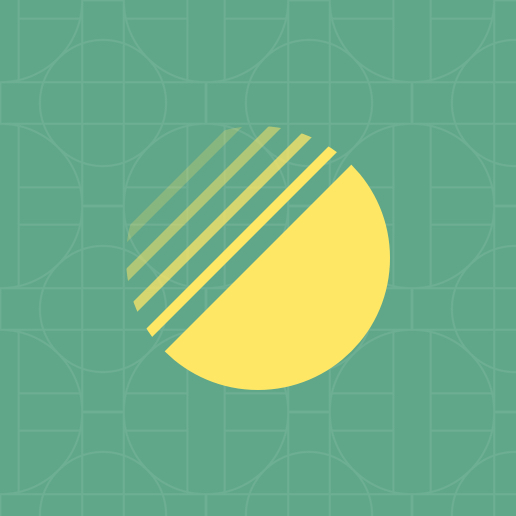

<p align="center">
  
</p>

<div align="center">

[][community-reactiflux]

</div>

<br/>

**Atomic Layout** is a spatial distribution library for React. It uses [CSS Grid][css-grid] to define layout areas and render them as React components. This pattern encourages separation of elements and spacing, preventing contextual implementations and boosting maintenance of layouts.

```jsx
import React from 'react'
import { Composition } from 'atomic-layout'

// Define layout areas: visual representation
// of what composes a layout, detached from
// what components are actually rendered.
const areasMobile = `
  thumbnail
  header
  footer
`

// Declare responsive changes of your areas.
// Operate in two dimensions, remove areas
// or introduce new ones.
const areasTablet = `
  thumbnail header
  thumbnail footer
`

const Card = ({ title, imageUrl, actions }) => (
  <Composition areas={areasMobile} areasMd={areasTablet} gap={20}>
    {/* Get React components based on provided areas */}
    {({ Thumbnail, Header, Footer }) => (
      <React.Fragment>
        <Thumbnail>
          {/* Render anything, including another Composition */}
          
        </Thumbnail>
        {/* Preserve semantics with polymorphic prop */}
        <Header as="h3">{title}</Header>
        {/* Responsive props: just suffix with a breakpoint name */}
        <Footer padding={10} paddingMd={20}>
          {actions}
        </Footer>
      </React.Fragment>
    )}
  </Composition>
)

export default Card
```

> Atomic Layout is responsive-first. It uses [Bootstrap 4 breakpoints][bootstrap-4-breakpoints] by default, which you can always [customize for your needs](https://redd.gitbook.io/atomic-layout/api/layout/configure#breakpoints).

## Motivation

Modern layout development is about modularity and composition. Following the best practices of [Atomic design][atomic-design], we strive toward independent UI units that gradually compose into more meaningful pieces. While the attention paid to units implementation is thorough, we often overlook how to achieve layout composition that scales. It's as if we forget that _spacing defines composition_.

When it comes to distributing the spacing things get more difficult. First of all, true contextless spacing is hard. To make things worse, all present solutions couple spacing with UI elements, inevitably making small reusable pieces **contextful** and, thus, hard to maintain.

Atomic Layout helps you to compose your elements by introducing a dedicated spacing layer called _Composition_. It encourages you to separate concerns between UI elements' visual appearance and spacing between them. With the first-class responsive support at your disposal you can build gorgeous responsive permutations of your elements without leaving the dedicated spacing layer, keeping UI elements contextless and predictable. Embrace the era of a true layout composition!

## Implementations

Atomic Layout has multiple implementations depending on the styling solution:

| Package name                                                 | Latest version                                                                                                                      | Styling library     |
| ------------------------------------------------------------ | ----------------------------------------------------------------------------------------------------------------------------------- | ------------------- |
| [`atomic-layout`](./packages/atomic-layout)                  | [](https://www.npmjs.com/package/atomic-layout)                   | `styled-components` |
| [`@atomic-layout/emotion`](./packages/atomic-layout-emotion) | [](https://www.npmjs.com/package/@atomic-layout/emotion) | `@emotion/styled`   |

## Documentation

> **See the [Official documentation][atomic-layout-docs].**

Here are some shortcuts for quick access:

- [Motivation](https://redd.gitbook.io/atomic-layout/motivation)
- [**Getting started**](https://redd.gitbook.io/atomic-layout/getting-started)
- [Responsive props](https://redd.gitbook.io/atomic-layout/fundamentals/responsive-props)
- [Recipes](https://redd.gitbook.io/atomic-layout/recipes/semantics)

## Examples

> Although the examples below use `atomic-layout` package, they are fully compatible with other styling implementations of the library (i.e. `@atomic-layout/emotion`).

### Basics

<table border="0">
  <tr>
    <td width="33%" valign="top">
      <a href="https://codesandbox.io/s/basic-composition-5mvlr" target="_blank">
        
        <h4>Basic composition</h4>
      </a>
      <p>Combine two UI elements into a single one using Composition.</p>
    </td>
    <td width="33%" valign="top">
      <a href="https://codesandbox.io/s/responsive-props-8m14f" target="_blank">
        
        <h4>Responsive props</h4>
      </a>
      <p>Change a prop's value depending on a breakpoint.</p>
    </td>
    <td width="33%" valign="top">
      <a href="https://codesandbox.io/s/nested-composition-8p8pk" target="_blank">
        
        <h4>Nested composition</h4>
      </a>
      <p>Any element can be a composition <i>and</i> a composite at the same time.</p>
    </td>
  </tr>
</table>

### Intermediate

<table border="0">
  <tr>
    <td width="33%" valign="top">
      <a href="https://codesandbox.io/s/conditional-rendering-4k90o" target="_blank">
        
        <h4>Conditional rendering</h4>
      </a>
      <p>Render or display elements conditionally based on breakpoints.</p>
    </td>
    <td width="33%" valign="top">
      <a href="https://codesandbox.io/s/custom-configuration-d01ku" target="_blank">
        
        <h4>Custom configuration</h4>
      </a>
      <p>Configure a default measurement unit, custom breakpoints, and responsive behaviors.</p>
    </td>
    <td width="33%" valign="top">
      <a href="https://codesandbox.io/s/atomic-layout-query-d2mdl" target="_blank">
        
        <h4>Shorthand media query</h4>
      </a>
      <p>Use a shorthand <code>query</code> function to declare inline media queries in CSS.</p>
    </td>
  </tr>
</table>

## Materials

<table border="0">
  <tr>
    <td>
      <a href="https://www.youtube.com/watch?v=_HrXUB97xQs">
        
      </a>
    </td>
    <td>
      <h3><a href="https://www.youtube.com/watch?v=_HrXUB97xQs">Creating layouts that last (React Finland, 2019)</a></h3>
      <p>Find out the main aspects of a layout's maintainability and why spacing plays a crucial role in it. Learn how to wield layout composition as an actual React component–a missing glue for your elements and design systems.</p>
      <ul>
        <li><a href="https://codesandbox.io/s/5wwp76310n"><strong>Live demo</strong></a></li>
      </ul>
    </td>
  </tr>
  <tr>
    <td>
      
    </td>
    <td>
      <h3><a href="https://survivejs.com/blog/atomic-layout-interview/">Layout composition as a React component (SurviveJS)</a></h3>
      <p>Read through the extensive interview about how Atomic layout came to be, how it's different from other solutions, and which practices it encourages.</p>
    </td>
  </tr>
  <tr>
    <td>
      <a href="https://www.youtube.com/watch?v=x_93DjN_bUA">
        
      </a>
    </td>
    <td>
      <h3><a href="https://www.youtube.com/watch?v=x_93DjN_bUA">The future of layouts (React Vienna, 2018)</a></h3>
      <p>Watch Artem discussing the biggest obstacle to achieve maintainable layouts, and showcases a way to combine existing technologies to build clean UI implementations using Atomic layout.</p>
      <ul>
        <li><a href="https://codesandbox.io/s/8z6xnmnnnj"><strong>Live demo</strong></a></li>
        <li><a href="http://future-of-layouts.surge.sh">Slides</a></li>
      </ul>
    </td>
  </tr>
</table>

## Community

Reach out to us to share an awesome project you're building, or ask a question:

- [Reactiflux][community-reactiflux]

## Browser support

Atomic Layout's browser support is made by the browser support of underlying technologies the library uses. Pay attention if your project can support CSS Grid to be sure you can use Atomic Layout.

> **See the [Support table for CSS Grid][css-grid-support]**. For Internet Explorer support please read [this issue](https://github.com/kettanaito/atomic-layout/issues/92).

## Contributing

By contributing to Atomic Layout you shape the way developers create reusable UI.

Please refer to the [Contribution guidelines](./.github/CONTRIBUTING.md) before committing to this project. We are thankful for any kind of contribution you may bring: discussion, issue report, or a pull request.

[npm-url]: https://npmjs.com/package/atomic-layout
[bundlephobia-url]: https://bundlephobia.com/result?p=atomic-layout
[build-url]: https://circleci.com/gh/kettanaito/atomic-layout
[test-coverage-url]: https://coveralls.io/github/kettanaito/atomic-layout
[dependencies-url]: https://david-dm.org/kettanaito/atomic-layout
[community-reactiflux]: https://discordapp.com/channels/102860784329052160/543033450924474378
[bootstrap-4-breakpoints]: https://getbootstrap.com/docs/4.0/layout/grid/#grid-options
[css-grid]: https://developer.mozilla.org/en-US/docs/Web/CSS/CSS_Grid_Layout
[css-grid-support]: https://caniuse.com/css-grid
[atomic-design]: https://bradfrost.com/blog/post/atomic-web-design/
[atomic-layout-docs]: https://redd.gitbook.io/atomic-layout
[react]: https://github.com/facebook/react
[styled-components]: https://github.com/styled-components/styled-components
